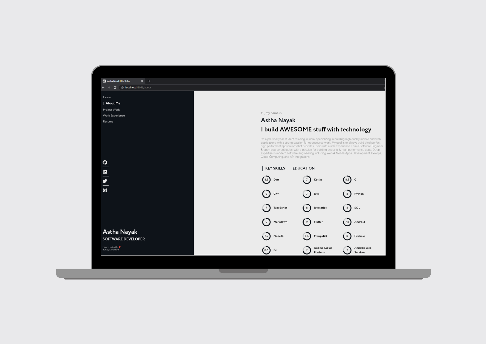

# PORTFOLIO WEBSITE
 This is the repository containing the code for portfolio website of Astha Nayak. Checkout the website at [asthanayak.tech](https://asthanayak.tech)

This repo contains an easy-to-customize personal dev portfolio template that was created with Flutter. It is lightweight and fully responsive, as well as comes loaded with awesome modern user interface. The site is static and comes production ready if you just want to add your information and go. Alternatively, you can edit styles, colours, and scripts fairly easily. The site was built as modular as possible to make it easy to shift around styles and content.

## Features
- Fully responsive
- Modern User Interface
- Customisable Template
- Lightweight

## Setup and Configuration
The setup required can be broken into two types:
- If you want to make edits or customize the template
- If you just want to add your information as use as is

#### Irrespective of type of output you have to do the following:
1. `Install Flutter on your machine`
- Install flutter by selecting the operating system on which you are installing Flutter: [Flutter installation tutorial](https://flutter.dev/docs/get-started/install)
- To check if you have flutter installed along wtih proper necesarry SDKs installed run flutter doctor

2. `Fork and Clone the Repository`
- Fork the repo by clicking on the Fork button on the top right corner of the page. To clone this repository, run `git clone https://github.com/nayakastha/portfolio.git` Then run `cd portfolio`.

3. Get Packages
- Make sure you are in the `portfolio/portfolio` directory.
- From the terminal: Run `flutter pub get`. OR
    From Android Studio/IntelliJ: Click Packages get in the action ribbon at the top of pubspec.yaml.
    From VS Code: Click Get Packages located in right side of the action ribbon at the top of pubspec.yaml.

#### Making Edits / Customizing the Template
To setup, simply move to the `values` directory and change the values of colors, fonts, and other variables. You can also add your own custom styles and scripts. 

#### Using The Template As Is
If you wish to use the template as is (i.e. how it's seen in my portfolio), then all that's required is making changes in the `data.dart` file and you are good to go.

## Contributing

`Contributions are always welcome 🎉🎉`

Please refer to the project's style and contribution guidelines for submitting patches and additions. In general, we follow the "fork-and-pull" Git workflow.
- Fork the repo on GitHub
- Clone the project to your own machine
- Commit changes to your own branch
- Push your work back up to your fork
- Submit a Pull request so that I can review your changes

